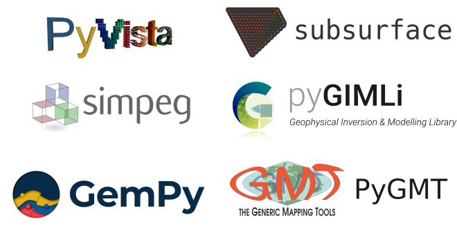

<!--
This file defines the contents of each slide.
The reveal.js configuration can be found in index.html
-->

<!-- .slide: class="slide-title" data-background-color="#000000" data-background-image="assets/background.svg" data-background-repeat="no-repeat" data-background-position="center" -->

# Fatiando a Terra

## open-source tools for geophysics

### Santiago Soler

Geophysical Inversion Facility, UBC
|
Aug 2022

**Check the slides in
[santisoler.com/2022-ubc-fatiando](https://www.santisoler.com/2022-ubc-fatiando)**

<i class="fab fa-twitter fa-fw"></i> [@fatiandoaterra](https://twitter.com/fatiandoaterra)
|
<i class="fa fa-camera"></i>
Feel free to screenshot/share/reuse/remix this presentation
|
[<i class="fab fa-creative-commons"></i><i class="fab fa-creative-commons-by"></i> CC-BY 4.0 License](https://creativecommons.org/licenses/by/4.0/)

based on the
<a href="https://www.fatiando.org/2021-gsh">
Geophysical Society of Houston talk
</a>
by Leonardo Uieda, Santiago Soler
and Agustina Pesce (CC-BY 4.0)

---

<!-- .slide: class="slide-transition" data-background-color="rgb(25, 34, 55)" -->

# A bit of history

---

<!-- .slide: data-background-video="assets/brasil-sao-paulo-rio.mp4" data-background-size="contain" data-background-color="#000000" -->

Our journey starts in Southeastern Brazil, specifically in São Paulo and Rio de
Janeiro

---

<h2 style="text-align: center">Leonardo Uieda</h2>

<ul class="fa-ul bio">
<li><i class="fa-li fa fa-university"></i>University of Liverpool, UK</li>
<li><i class="fa-li fab fa-github"></i><a href="https://github.com/leouieda">@leouieda</a></li>
<li><i class="fa-li fab fa-twitter"></i><a href="https://twitter.com/leouieda">@leouieda</a></li>
<li><i class="fa-li fas fa-globe"></i><a href="https://www.leouieda.com">leouieda.com</a></li>
</ul>

<h2 style="text-align: center">Vanderlei Oliveira Jr.</h2>

<ul class="fa-ul bio">
<li><i class="fa-li fa fa-university"></i>Observatório Nacional, Rio de Janeiro, Brazil</li>
<li><i class="fa-li fab fa-github"></i><a href="https://github.com/leouieda">@birocoles</a></li>
</ul>

---

<!-- .slide: data-background-image="assets/fatiando-as-a-gravmag-gui.svg" data-background-size="contain" data-background-repeat="no-repeat" data-background-color="#000000" -->

Started around 2008 as a GUI for **2D modelling** developed with
fellow **undergrads** at USP, Brazil

---

<!-- .slide: data-background-image="assets/fatiando-as-a-gravmag-gui.svg" data-background-size="contain" data-background-repeat="no-repeat" data-background-color="#000000" -->

Actual diagram of the GUI workflow retrieved from our version control system.

---

<!-- .slide: data-background-image="assets/fatiando-first-commit.svg" data-background-size="contain" data-background-repeat="no-repeat" data-background-color="#000000" -->

Transitioned into the *fatiando* **Python library** in 2010 during Leo's
MSc in Rio
(commit: [928515b](https://github.com/fatiando/fatiando/commit/928515b0fcfdccecbc4f661ed2469390ef43ec1d))

---

<!-- .slide: data-background-image="assets/fatiando-first-commit-vcs.svg" data-background-size="contain" data-background-repeat="no-repeat" data-background-color="#000000" -->

**Learned a lot** about software development: tests, packaging, documentation,
 
version control (went through SVN, Mercurial, and Git), and more.

---

<!-- .slide: data-background-image="assets/fatiando-first-gallery.jpg" data-background-size="contain" data-background-repeat="no-repeat" data-background-color="#000000" -->

Around 2011 they built the first website and gallery. They ended up building
a 2D GUI and much more,
 
from seismic to potential fields and heat flow.

---

<!-- .slide: data-background-image="assets/fatiando-docs-v0.1.jpg" data-background-size="contain" data-background-repeat="no-repeat" data-background-color="#000000" -->

First documentation built using [sphinx](https://www.sphinx-doc.org) for
**v0.1** (2013). doi:[10.5281/zenodo.16207](https://doi.org/10.5281/zenodo.16207)

---

<!-- .slide: data-background-image="assets/fatiando-docs-v0.2.jpg" data-background-size="contain" data-background-repeat="no-repeat" data-background-color="#000000" -->

Updated documentation for **v0.2** (2014). doi:[10.6084/m9.figshare.1115194](https://doi.org/10.6084/m9.figshare.1115194)

---

<!-- .slide: data-background-image="assets/fatiando-docs-v0.5.jpg" data-background-size="contain" data-background-repeat="no-repeat" data-background-color="#000000" -->

Last update for **v0.5** (2016). doi:[10.5281/zenodo.157746](https://doi.org/10.5281/zenodo.157746)
 
You can still browse the v0.5 docs in
[legacy.fatiando.org](https://legacy.fatiando.org)

---

<!-- .slide: data-background-color="#000000" data-background-image="assets/background.svg" data-background-repeat="no-repeat" data-background-position="center" -->

## Fun fact

Fatiando a Terra means _slicing the Earth_ in Portuguese

🔪🌎

---

<!-- .slide: data-background-color="#000000" data-background-image="assets/background.svg" data-background-repeat="no-repeat" data-background-position="center" -->

I started using Fatiando during   my Licentiate dissertation

---

<!-- .slide: data-background-image="images/santi-first-pr.png" data-background-size="contain" data-background-repeat="no-repeat" data-background-color="#000000" -->

First contributions to the project circa 2016

---

<h1 style="color: #0000dd;">
<i class="far fa-thumbs-up" style="margin-right: 20px;"></i>
The good parts
</h1>

<ul class="fa-ul">

<li>
 <i class="fa fa-lightbulb fa-fw"></i> 
State-of-the-art algorithms
</li>

<li>
 <i class="fa fa-file-alt fa-fw"></i> 
Used in several thesis & papers (>70 citations)
</li>

<li>
 <i class="fa fa-users fa-fw"></i> 
2-3 active contributors
</li>

<li>
 <i class="fa fa-chalkboard-teacher fa-fw"></i> 
Enabled teaching through simulation
</li>

</ul>

<h1 style="color: #dd0000;">
<i class="far fa-thumbs-down" style="margin-right: 20px;"></i>
The bad parts
</h1>

<ul class="fa-ul">

<li>
 <i class="fa fa-gamepad fa-fw"></i> 
Too many toy problems and experimental code
</li>

<li>
 <i class="fas fa-vial fa-fw"></i> 
Not designed for testability
</li>

<li>
 <i class="fa fa-tools fa-fw"></i> 
Difficult to maintain
</li>

<li>
 <i class="fa fa-landmark fa-fw"></i> 
Unstable foundations for growth
</li>

</ul>

---

# Growing Geoscience Python ecosystem

---

### ✨New Fatiando✨

Split into libraries

Better coding practices

Use modern tools

Supplement the ecosystem

Data <b>download & caching</b> (used by other libraries)

<ul class="fa-ul project-icons">
<li><i class="fa-li fab fa-github fa-fw" title="Github repository"></i>
   <a href="https://github.com/fatiando/pooch">fatiando/pooch</a>
</li>
<li><i class="fa-li fas fa-bookmark fa-fw" title="Publication"></i>
   doi: <a href="https://doi.org/10.21105/joss.01943">10.21105/joss.01943</a>
</li>
<li><i class="fa-li fa fa-check fa-fw" style="color: green" title="Project status"></i>
   Stable and ready for use
</li>
</ul>

ML-based point data processing and <b>gridding</b>

<ul class="fa-ul project-icons">
<li><i class="fa-li fab fa-github fa-fw" title="Github repository"></i>
   <a href="https://github.com/fatiando/verde">fatiando/verde</a>
</li>
<li><i class="fa-li fas fa-bookmark fa-fw" title="Publication"></i>
   doi: <a href="https://doi.org/10.21105/joss.00957">10.21105/joss.00957</a>
</li>
<li><i class="fa-li fa fa-check fa-fw" style="color: green" title="Project status"></i>
   Stable and ready for use
</li>
</ul>

Processing and modeling <b>gravity & magnetic</b> data

<ul class="fa-ul project-icons">
<li><i class="fa-li fab fa-github fa-fw" title="Github repository"></i>
   <a href="https://github.com/fatiando/harmonica">fatiando/harmonica</a>
</li>
<li><i class="fa-li fa fa-sync-alt fa-fw" style="color: green" title="Project status"></i>
   Ready for use but still changing
</li>
</ul>

Reference <b>ellipsoids</b> for <b>normal gravity</b>

<ul class="fa-ul project-icons">
<li><i class="fa-li fab fa-github fa-fw" title="Github repository"></i>
   <a href="https://github.com/fatiando/boule">fatiando/boule</a>
</li>
<li><i class="fa-li fa fa-sync-alt fa-fw" style="color: green" title="Project status"></i>
   Ready for use but still changing
</li>
</ul>

**Practice datasets** to probe your code

<ul class="fa-ul project-icons">
<li><i class="fa-li fab fa-github fa-fw" title="Github repository"></i>
   <a href="https://github.com/fatiando/ensaio">fatiando/ensaio</a>
</li>
<li><i class="fa-li fa fa-flask fa-fw" style="color: green" title="Project status"></i>
    Functional but still evolving
</li>
</ul>

---

<!-- .slide: class="slide-transition" data-background-color="#000000" data-background-image="assets/demo-time.gif" data-background-repeat="no-repeat" data-background-position="center" data-background-opacity="70%" -->

# Demo time!

---

<!-- .slide: data-background-image="assets/papers.svg" data-background-size="contain" data-background-repeat="no-repeat" data-background-color="#ffffff" -->

<h1 style="background-color: #000000bb; color: #ffffff; padding: 5px 40px;">
Fatiando in the wild
</h1>

---

# How to get started

<ul class="fa-ul">

<li class="fragment">
<i class="fab fa-python"></i>
Not experienced with Python?
    <ul style="margin: 1em 0 0 1em;">
    <li>
     <a href="https://swcarpentry.github.io/python-novice-inflammation/">Programming with Python</a>
    </li>
    <li>
    <a href="https://swcarpentry.github.io/python-novice-gapminder/">Plotting and Programming in Python</a>
    </li>
    </ul>
</li>

<li class="fragment">
<i class="fab fa-youtube"></i>
✨ New tutorials page ✨ in <a href="https://www.fatiando.org/tutorials">fatiando.org/tutorials</a>
</li>

<li class="fragment">
<i class="fab fa-youtube"></i>
Video tutorials about <a href="https://www.youtube.com/watch?v=-xZdNdvzm3E">Verde</a>
and <a href="https://www.youtube.com/watch?v=0bxZcCAr6bwab_channel=SoftwareUnderground">Harmonica</a>
</li>

<li class="fragment">
 <i class="fas fa-book"></i> 
Documentation for each library
(links at <a href="https://www.fatiando.org">fatiando.org</a>)
</li>

</ul>

---

<!-- .slide: class="slide-transition" data-background-color="rgb(25, 34, 55)" -->

<h1>
More than just code <i class="fas fa-code"></i>
 
it's a <strong>community</strong> <i class="fas fa-users"></i>
</h1>

---

# How to get involved

There are many ways to participate:

<ul>
<li class="fragment">Write code</li>
<li class="fragment">Work on documentation or examples</li>
<li class="fragment">Give feedback</li>
</lu>

<ul>
<li class="fragment">Join the conversation</li>
<li class="fragment">Share your experience</li>
<li class="fragment">Help guide future development</li>
</ul>

**Your help is always welcome!**

---

# Where to find us

<ul class="fa-ul">

<li class="fragment">
<i class="fab fa-slack"></i>
<a href="http://contact.fatiando.org/">Slack</a>:
talk to users and developers
</li>

<li class="fragment">
<i class="fab fa-github"></i>
<a href="https://github.com/fatiando/">GitHub</a>:
where we discuss development details and review code
</li>

<li class="fragment">
<i class="fa fa-microphone-alt"></i>

<a href="https://github.com/fatiando/meeting-notes">Community Calls</a>:
regular video calls open to everyone (not just developers)

</li>

</ul>

---

<!-- .slide: class="slide-transition" data-background-color="rgb(25, 34, 55)" -->

# You are welcome as   a member or contributor!   <i class="fas fa-rocket"></i>

---

Find out more:
[fatiando.org](https://www.fatiando.org)

Slides + demo:
[github.com/santisoler/2022-ubc-fatiando](https://github.com/santisoler/2022-ubc-fatiando)

---

<!-- .slide: class="slide-license" -->

<i class="fab fa-creative-commons"></i><i class="fab fa-creative-commons-by"></i>

Unless otherwise noted,
the contents of this presentation are
licensed under the
 
[Creative Commons Attribution 4.0 International License](https://creativecommons.org/licenses/by/4.0/).

